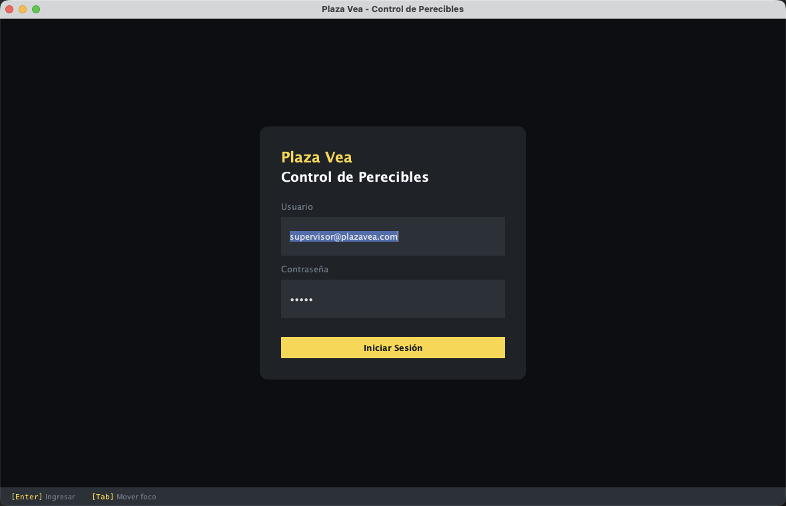
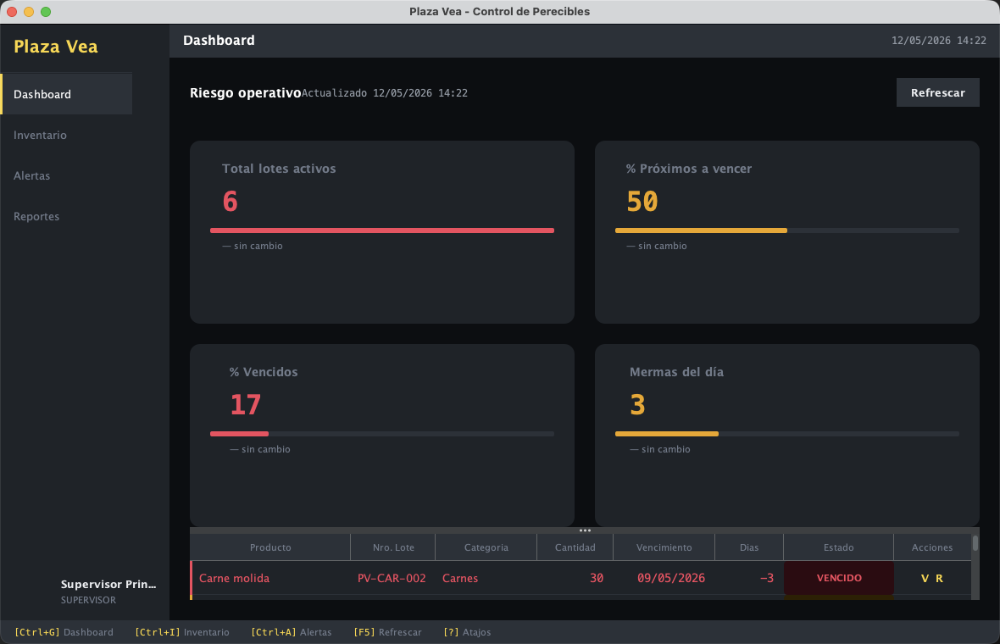
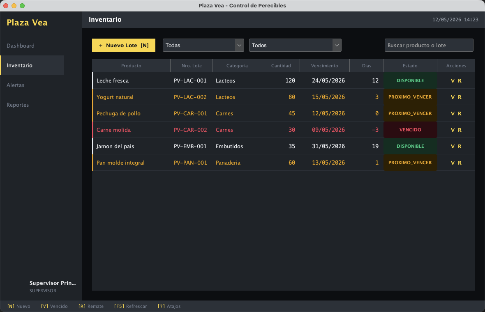
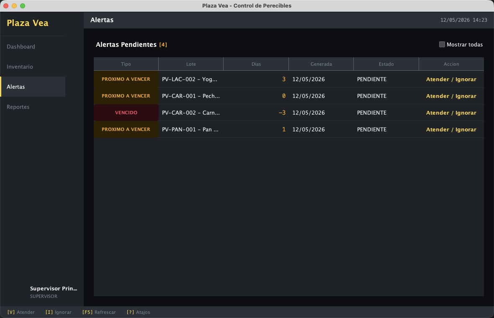
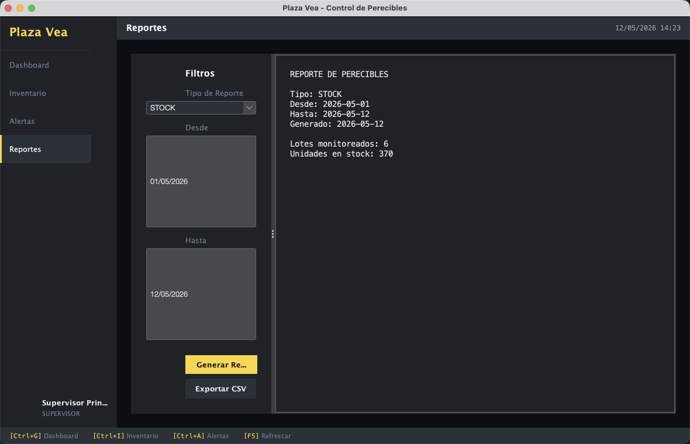

# Interfaces

### Acceso al Sistema de Informacion
- El acceso al sistema de informacion esta restringido a usuarios registrados. En esta pantalla se ingresa el usuario en el primer campo de texto y la contrasena en el segundo campo. Luego se presiona el boton **Iniciar Sesion** para validar las credenciales y entrar al sistema.

### Dashboard
- Esta interfaz muestra un resumen del riesgo operativo de los productos perecibles. Presenta indicadores de lotes activos, productos proximos a vencer, productos vencidos y mermas del dia, ademas de una tabla con los lotes que requieren mayor atencion.

### Inventario
- En esta pantalla se consulta el stock registrado por lote. Permite filtrar por categoria, estado y texto de busqueda, ademas de registrar un nuevo lote o marcar productos para acciones como vencimiento o remate.

### Alertas
- Esta interfaz centraliza las alertas pendientes generadas por fechas de vencimiento. Desde aqui el usuario puede revisar el tipo de alerta, los dias restantes, el lote asociado y atender o ignorar cada alerta.

### Reportes
- La pantalla de reportes permite generar consultas por tipo de reporte y rango de fechas. El resultado se muestra en una vista previa y puede exportarse en formato CSV para su analisis o archivo.

